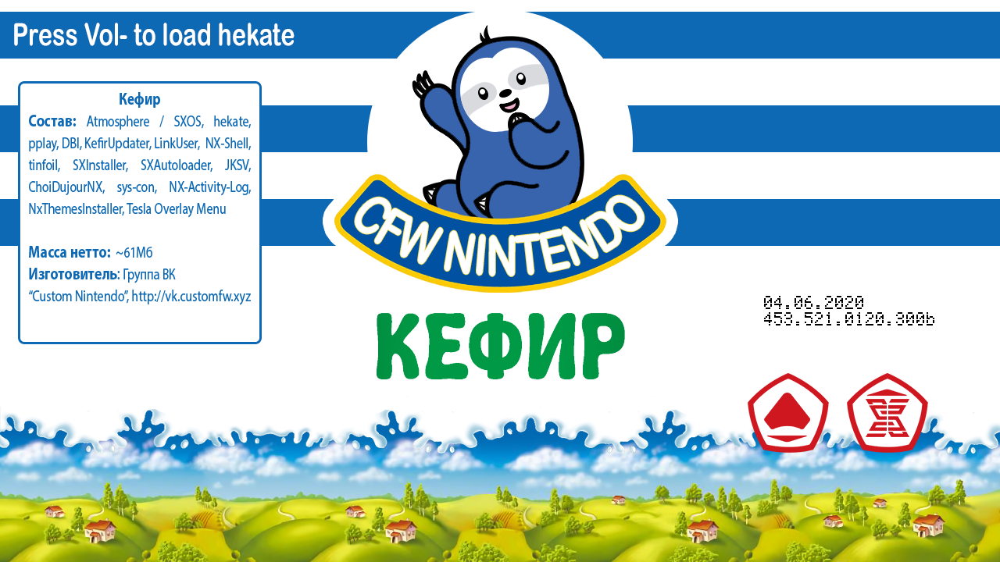

# Kefir

## What is Kefir

This is a collection consisting of modified Atmosphere, necessary programs and scripts that install everything correctly. It was created to facilitate the installation and maintenance of software on a hacked Nintendo Switch. The changes made to Atmosphere are aimed at improving the quality of using the system itself.

Main differences from vanilla Atmosphere:
  * Kefir versions alongside system versions
  * Installation of exFAT memory card driver by default when updating the system
  * Removal of ACID signature verification for using homebrew without patches
  * Removal of system logging to prevent memory card cluttering and excessive usage
  * Redirection of saves from internal memory to memory card when using emuNAND to reduce the probability of losing them if emuNAND fails (optional)

**Kefir** is **not a firmware**! It's a collection consisting of Atmosphere firmware and the necessary minimum of recommended programs, plugins, modules and other software.

## Why do you need Kefir?

First of all, Kefir is needed to simplify the user's life. That is, if the user has the recommended version of system software and the latest version of Kefir, then everything should work for them. It can be said that the user is in controlled conditions. It's enough to name the version of the system software and Kefir, and it immediately becomes clear what is approximately installed in the system.

## Kefir composition

1. **[Kefirosphere](https://github.com/rashevskyv/Kefirosphere)**, a fork of [Atmosphere](https://github.com/Atmosphere-NX/Atmosphere)
2. **Signature patches**. Thanks to them, you can run unsigned (read: *pirated*) programs and games on Atmosphere.
3. **Bootloader [hekate](https://github.com/CTCaer/hekate)**: Thanks to the bootloader, you can launch firmware and other payloads through a convenient menu, create and restore NAND backups, make EmuNAND, get information about the system state, mount the memory card to PC without removing it from the switch, repartition the memory card for installing other OSes, and much more
4. **Installed payloads**:
  * [Lockpick_RCM](https://codeberg.org/rashevskyv/Locktrick/) - program for dumping console keys
  * [TegraExplorer](https://github.com/rashevskyv/TegraExplorer/) - file manager for Switch in the form of a payload. Analog of GodMode9 for 3DS
5. **Installed Homebrew**
  * [DBI](https://github.com/rashevskyv/dbi) - program for installing games via USB or from memory card
  * [Tinfoil](http://tinfoil.io) - program that allows downloading games for the console directly from the network
  * [Kefir Updater](https://github.com/rashevskyv/kefir-updater) - program for updating kefir via internet
  * [Sphaira](https://github.com/ITotalJustice/sphaira/releases/) - environment for running homebrew, downloading themes and applications on switch, file manager 
  * [Daybreak](https://github.com/Atmosphere-NX/Atmosphere/tree/0.14.1/troposphere/daybreak) - program for safe updating of the console's system software version
  * [NXThemes Installer](https://github.com/exelix11/SwitchThemeInjector) - custom themes manager
  * [Linkalho](https://github.com/rdmrocha/linkalho) - program for linking account
6. **Installed modules**. Modules are additional components that work inside Atmosphere and allow you to do various cool things, for example, using Xbox-compatible controllers, amiibo emulation, overclocking, etc. Unfortunately, SX OS does not support modules
  * [sys-con](https://github.com/o0Zz/sys-con) - module that allows connecting almost any gamepad to the console via USB
  * [Mission Control](https://github.com/ndeadly/MissionControl) - module that allows connecting almost any gamepad to the console via bluetooth
  * [Uberhand](https://github.com/efosamark/Uberhand-Overlay) - special overlay menu for system interaction with support for custom scripts and modules
    - Scripts:
      * **DBI** - changing localization and updating the program
      * **Translate Interface** - additional interface translations to choose from
      * **Semi-stock** - loading into semi-stock from the menu
      * **Reboot and Shutdown** - restarting and shutting down the console from the menu
    - Modules:
      - [nx-ovlloader](https://github.com/WerWolv/nx-ovlloader//) - process for working with nro through Tesla Menu
      - [ovlEdiZon.ovl](https://github.com/proferabg/EdiZon-Overlay/releases) - Module for using cheats
      - [ovlSysmodules.ovl](https://github.com/WerWolv/ovl-sysmodules/) - Module for enabling and disabling installed system modules (e.g., overclocking, emuuibo, etc.)

## Instructions for installing/updating kefir

### First installation or installation on a clean memory card

1. Copy the **contents** of the `kefir.zip` archive from the repository to the root of the console's memory card
2. Insert the memory card into the Switch
3. Launch the console into firmware, according to your hack type. `payload.bin` - the payload that needs to be injected when launching the console via Fusée Gelée, is located in the archive with the collection

### Updating kefir or transitioning from another collection

#### Manual installation instructions (all OS)

##### Connecting the console's memory card to PC

If you are a MacOS user, follow the recommended steps to avoid problems with the memory card.

If the console is turned off, insert the memory card into the PC. If it's turned on:
1. Restart the console through the menu that is called by holding the (POWER) button
2. On the kefir splash screen, press the volume down button to get to hekate
3. Now you can remove the memory card from the switch and insert it into the PC.

> When removing the memory card in hekate, you won't need to re-inject the payload to enter the firmware. Just insert the card into the console and launch the firmware through the **Launch** menu

##### Installing kefir (all OS)

1. Copy the **contents** of the `kefir.zip` archive from the repository to the root of the console's memory card
2. Insert the memory card back into the Switch
3. In **hekate**, select **More configs** -> **Update Kefir**
4. After the installation is complete, the console will boot into the firmware

> You can also simply turn off the console, remove the card from it, copy kefir onto it with replacement, then insert the card back into the Switch and turn on the console. In this case, the update script will be launched automatically

#### Updating kefir directly on the console (kefir version 529 or higher)

1. Launch HBL
2. Select **Kefir Updater** (Internet connection required!)
3. Click "**Update Kefir**", click on "**Kefir [version]**", select "**Download**"
4. Wait for the download and unpacking to complete, then click "**Continue**". The console will reboot into the payload, after which the kefir installation process will begin
5. After the installation is complete, press any button to load the console into the firmware

#### Clean kefir installation (recommended when errors occur)

1. Delete everything from the card except the `Nintendo` and `emummc` folders, if they exist
2. Install kefir using a convenient method described above

#### Debugging kefir installation (recommended if a clean installation didn't help)

1. Copy the `Nintendo` and `emummc` folders, if they exist, to PC
2. Format your memory card in FAT32 and return the folders back
3. Install kefir using a convenient method

### Troubleshooting

If you encounter a [NOFAT] error or any other problem with updating through the `kefir-updater` script, use the kefir installation through `install.bat`:

1. Unpack `kefir.zip` to any convenient location **on PC**, *except the console's memory card*
2. **Insert into PC** the console's memory card
3. Run `install.bat` from the folder where you unpacked `kefir.zip` and specify the letter of your memory card
4. Wait for the copying to complete
5. Insert the card into PC and launch the firmware

> If you get the "**Is BEK missing**" error, turn off the console and turn it on again.

## Launching Atmosphere

If after entering the firmware the console doesn't see the card and requires a firmware update for it to work, or simply hangs on a black screen after the Nintendo logo, then your console doesn't have exFAT drivers installed! Format the memory card in FAT32.

In hekate, autoboot is set by default. That is, when the console starts, the hekate menu will not be displayed, but the firmware will start immediately. To go to the hekate menu, hold (VOL-) during the splash screen appearance.

### **Important Information!**

  * Reboot to hekate happens directly from the firmware, through the normal reboot menu. Just hold (VOL-) during the kefir splash screen
  * You can access your memory card without removing it from the console via MTP (**DBI** -> **Run MTP Responder**), or through hekate (does not work correctly for everyone, **it is impossible to update kefir via MTP**)
  * Installing and updating kefir are done the same way!
  * If you encounter the "**Is BEK missing**" error, turn off the console and turn it on again.

## Additional Information
* To work with modules ([sys-con](https://github.com/cathery/sys-con/releases/latest), [Mission Control](https://github.com/ndeadly/MissionControl), etc.) in kefir, [Uberhand](https://github.com/efosamark/Uberhand-Overlay) is installed - a special overlay menu for interacting with the system. To activate it, press (L) + **d-pad down** + (R3)
* To switch to semi-stock
  * **From the firmware itself**: go to Uberhand ((L) + **d-pad down** + (R3)), press right > `Semi-stock`
  * **When starting the console**: Navigate to hekate and select `More-configs` > `Semi-stock (blackscreen fix)`
  * Note that when launching from firmware, the installed theme will be disabled, which will help avoid errors if there are different versions of system software and emuNAND on the console
* You can update kefir using the **Kefir Updater** utility

### Overclocking
* **Enabling**
  To activate overclocking, go to Uberhand ((L) + **d-pad down** + (R3)), press right > `Settings` > `Use overclock`
* **Disabling**
  To disable overclocking, go to Uberhand ((L) + **d-pad down** + (R3)), press right > `Settings` > `Disable overclock`

### 8GB Memory Support Mode
* **Enabling**
  * To enable, go to Uberhand ((L) + **d-pad down** + (R3)), press right > `Settings` > `Enable 8GB support`
* **Disabling**
  * To disable, reinstall kefir using a convenient method
